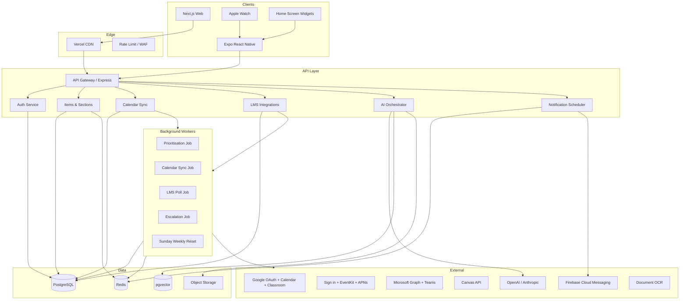
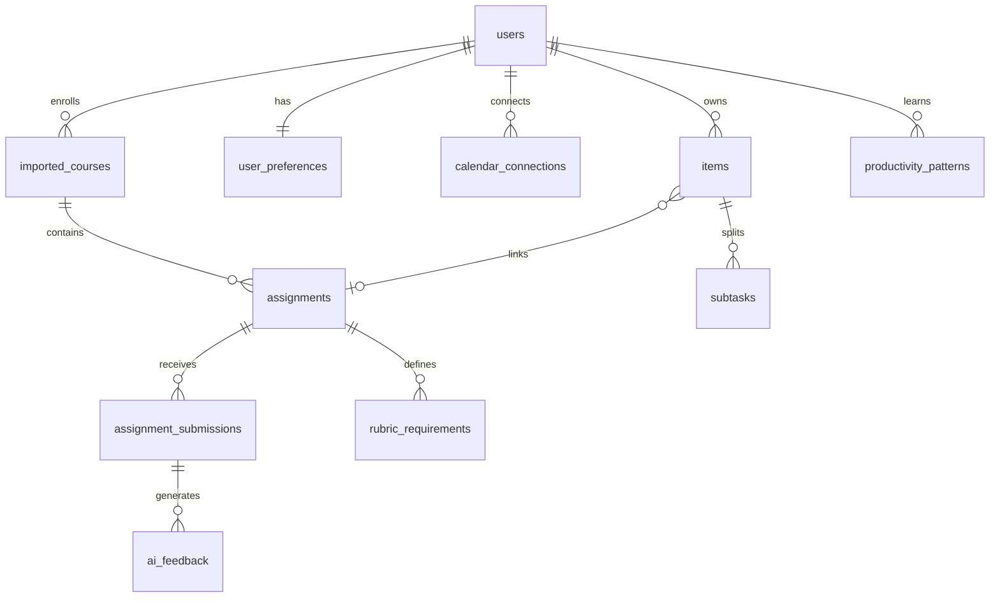
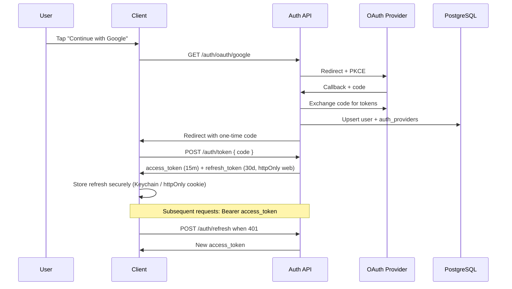
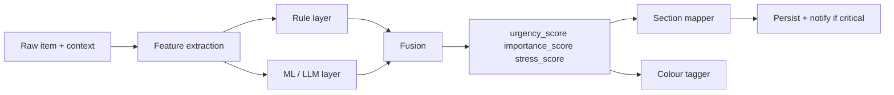
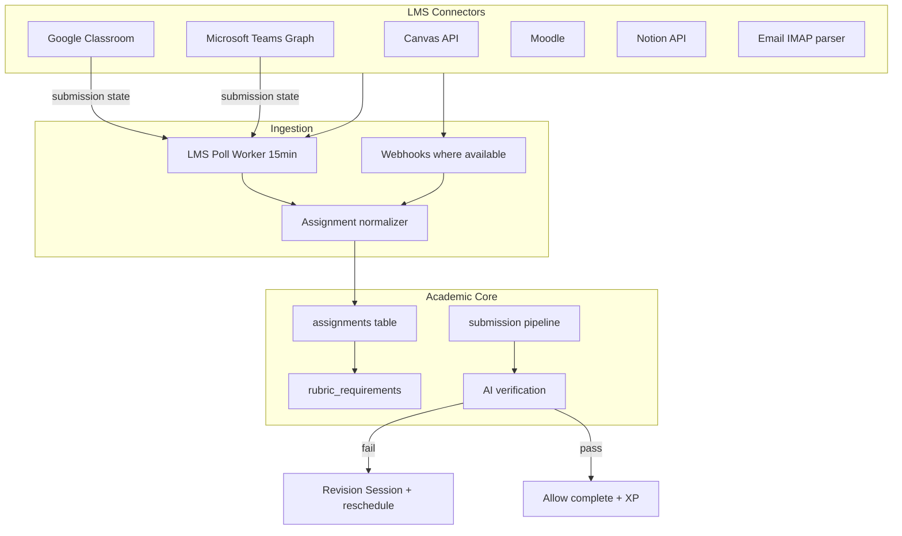

# Pulse — Complete Product & Technical Blueprint

> **Working title:** Pulse (rename anytime)  
> **Positioning:** A calming, intelligent life operating system — not another stressful todo list.

---

## Table of contents

1. [Full app architecture](#1-full-app-architecture)
2. [Database schema](#2-database-schema)
3. [API structure](#3-api-structure)
4. [UI component hierarchy](#4-ui-component-hierarchy)
5. [Recommended folder structure](#5-recommended-folder-structure)
6. [Authentication flow](#6-authentication-flow)
7. [Calendar sync logic](#7-calendar-sync-logic)
8. [AI prioritisation algorithm](#8-ai-prioritisation-algorithm)
9. [Notification system](#9-notification-system)
10. [Onboarding flow](#10-onboarding-flow)
11. [Wireframe ideas](#11-wireframe-ideas)
12. [Modern UI design system](#12-modern-ui-design-system)
13. [Future scaling suggestions](#13-future-scaling-suggestions)
14. [App Store launch roadmap](#14-app-store-launch-roadmap)
15. [Monetisation ideas](#15-monetisation-ideas)
16. [School / work automation system](#16-school--work-automation-system)

---

## 1. Full app architecture

### High-level system diagram



### Architectural principles

| Principle | Implementation |
|-----------|----------------|
| **Calm by default** | UI shows one “focus” section; advanced views are opt-in |
| **Offline-first mobile** | SQLite/WatermelonDB cache; sync queue on reconnect |
| **Event-driven sync** | Calendar/LMS changes via webhooks + polling fallback |
| **AI as advisor, not boss** | Scores are explainable; user can override section/colour |
| **Firm for school mode** | Submission verification is a separate bounded context |
| **Multi-tenant safe** | Row-level `user_id` on every table; encrypted OAuth tokens |

### Service boundaries

| Service | Responsibility |
|---------|----------------|
| **Identity** | OAuth, JWT, sessions, device tokens |
| **Items** | CRUD, sections, drag order, recurrence |
| **Intelligence** | Scoring, scheduling, panic mode, brain dump NLP |
| **Calendar** | Two-way sync, free-slot detection, conflict resolution |
| **Academics** | LMS import, submissions, rubric AI, escalation |
| **Engagement** | XP, pet, achievements, shared spaces |
| **Notifications** | Scheduling, escalation, quiet hours |

### Tech stack (recommended)

| Layer | Choice | Rationale |
|-------|--------|-----------|
| Web | **Next.js 15** + RSC where useful | SEO, fast dashboards, Vercel deploy |
| Mobile | **Expo (React Native)** | One team, shared TS types, OTA updates |
| API | **Node + NestJS** (or Express modules) | Mature OAuth/calendar SDKs |
| DB | **PostgreSQL** + Prisma/Drizzle | Relational + pgvector |
| Cache/queue | **Redis** + **BullMQ** | Jobs, rate limits, session cache |
| Auth | **Supabase Auth** *or* custom Passport | Google/Apple/email quickly |
| Storage | **S3-compatible** (R2/S3) | Submissions, rubric PDFs |
| Push | **FCM** + **APNs** via Expo | Cross-platform |
| AI | **OpenAI GPT-4o** + structured outputs | Parsing, verification, planning |
| Analytics | **PostHog** (privacy-conscious) | Funnels without selling data |

---

## 2. Database schema

Full SQL: [`schema.sql`](./schema.sql)

### Entity relationship (core)



### Key tables (summary)

| Table | Purpose |
|-------|---------|
| `items` | Unified model for task/reminder/event/deadline/routine/note |
| `productivity_patterns` | Learned procrastination, peak hours, avg duration |
| `calendar_connections` / `calendar_events` | External calendar mirror |
| `assignments` | LMS-linked academic work |
| `assignment_submissions` | In-app uploads + LMS confirmation |
| `ai_feedback` | Rubric-aligned review results |
| `completion_attempts` | Audit trail when user tries to mark done |
| `notifications` | Scheduled + escalation state |
| `study_sessions` | Planned/revision blocks |
| `virtual_pets` | Gamification growth state |

### Indexing strategy

- `(user_id, smart_section, status)` — home feed
- `(user_id, due_at)` — calendar/timeline
- `ivfflat` on `items.embedding` — semantic “find similar” / brain dump clustering
- Partial index on `assignments(due_at)` where `is_submitted_verified = false`

---

## 3. API structure

OpenAPI outline: [`openapi.yaml`](./openapi.yaml)

### Versioning & conventions

- Base path: `/v1`
- Auth: `Authorization: Bearer <access_token>`
- Pagination: `?cursor=&limit=50`
- Idempotency: `Idempotency-Key` header on POST for items/submissions
- Errors: RFC 7807 problem+json

### Endpoint groups

| Group | Key routes |
|-------|------------|
| **Auth** | `POST /auth/register`, `/login`, `/refresh`, `GET /auth/oauth/{provider}` |
| **Items** | CRUD, `/items/sections`, `/items/{id}/complete`, `/items/{id}/reorder` |
| **AI** | `/brain-dump`, `/ai/plan-day`, `/ai/panic-mode`, `/ai/conversations` |
| **Calendar** | `/calendar/connections`, `/sync`, `/free-slots` |
| **LMS** | `/lms/connect/{provider}`, `/lms/sync`, `/assignments`, `/assignments/{id}/submit` |
| **Dashboard** | `GET /dashboard` — score, streaks, summary, widgets |
| **Notifications** | list + `/acknowledge` |

### Webhooks (inbound)

| Source | Event |
|--------|-------|
| Google Calendar | `sync` channel notifications |
| Google Classroom | coursework publish / submission state |
| Microsoft Graph | Teams assignment + calendar delta |
| Stripe | subscription lifecycle (premium) |

### Real-time (optional v1.1)

- **SSE** or **WebSocket** for: focus timer sync, live calendar updates, panic mode banner

---

## 4. UI component hierarchy

### App shell

```
App
├── ThemeProvider (preset + custom tokens)
├── AuthProvider
├── SyncProvider (offline queue status)
└── Router
    ├── OnboardingStack (first-run)
    └── MainTabs
        ├── HomeTab
        ├── PlanTab (sections / list)
        ├── CalendarTab
        ├── SchoolTab (assignments — if enabled)
        └── ProfileTab
```

### Home dashboard

```
HomeScreen
├── GreetingHeader (time-aware, calm copy)
├── DailySummaryCard (AI: "3 urgent, 2 meetings")
├── ProductivityScoreRing
├── StreakChip
├── PanicModeBanner (conditional)
├── WidgetGrid (configurable)
│   ├── FocusTimerWidget
│   ├── UpcomingDeadlinesWidget
│   ├── WeatherWidget
│   ├── QuoteWidget
│   ├── HabitTrackerWidget
│   └── VirtualPetWidget
└── QuickCaptureBar (NL input + voice)
```

### Items / planning

```
PlanScreen
├── ViewSwitcher (list | kanban | timeline | calendar)
├── SmartSectionList
│   └── SectionBlock
│       ├── SectionHeader (Do Now, Quick Wins…)
│       └── ItemCard[] (drag handle, colour strip, chips)
├── ItemDetailSheet
│   ├── MetaRow (due, estimate, course)
│   ├── SubtaskList
│   ├── AIInsightPanel ("Why this section?")
│   └── ActionBar (schedule, complete, defer)
└── FloatingActionButton → CreateItemModal
```

### School / assignments

```
AssignmentScreen
├── AssignmentHeader (course, due countdown)
├── RubricChecklist (from parsed rubric)
├── SubmissionUploader
├── AIFeedbackPanel (blocking issues)
├── StudyPlanTimeline
└── RevisionSessionCTA (if failed verify)
```

### Shared design primitives (`packages/ui`)

| Component | Variants |
|-----------|----------|
| `PulseCard` | elevated, glass, flat |
| `PulseButton` | primary, ghost, danger, focus |
| `PulseChip` | urgency colours |
| `PulseSection` | collapsible smart section |
| `PulseTimeline` | horizontal day rail |
| `PulseKanban` | columns = sections or custom |
| `CompletionBurst` | Lottie confetti / pet reaction |
| `AccessibilityToggle` | dyslexia font, high contrast |

---

## 5. Recommended folder structure

```
pulse/
├── apps/
│   ├── web/
│   │   ├── app/                    # Next.js App Router
│   │   │   ├── (auth)/
│   │   │   ├── (main)/
│   │   │   │   ├── home/
│   │   │   │   ├── plan/
│   │   │   │   ├── calendar/
│   │   │   │   ├── school/
│   │   │   │   └── settings/
│   │   │   └── api/                # BFF routes (optional)
│   │   ├── components/
│   │   └── lib/
│   └── mobile/
│       ├── app/                    # Expo Router
│       ├── components/
│       ├── modules/                # EventKit, widgets, watch
│       └── services/               # offline sync
├── packages/
│   ├── ui/                         # Design system
│   ├── core/
│   │   ├── prioritisation/
│   │   ├── sections/
│   │   ├── colours/
│   │   └── nlp/
│   ├── api-client/
│   └── config/                     # eslint, tsconfig
├── services/
│   └── api/
│       ├── src/
│       │   ├── modules/
│       │   │   ├── auth/
│       │   │   ├── items/
│       │   │   ├── calendar/
│       │   │   ├── lms/
│       │   │   ├── ai/
│       │   │   └── notifications/
│       │   ├── jobs/
│       │   └── main.ts
│       └── prisma/                 # or drizzle/
├── docs/
├── infra/                          # terraform / docker
└── turbo.json
```

---

## 6. Authentication flow



### Security checklist

- **PKCE** for mobile OAuth; **httpOnly** refresh on web
- **Apple Sign In** required if Google sign-in exists (App Store)
- Rotate refresh tokens on use (detect reuse → revoke family)
- Encrypt calendar/LMS tokens at rest (`pgcrypto` or KMS)
- RLS policies if using Supabase direct client (prefer API-only for LMS tokens)

---

## 7. Calendar sync logic

### Connection matrix

| Provider | Web | iOS | Android |
|----------|-----|-----|---------|
| Google Calendar | OAuth + API | OAuth + API | OAuth + API |
| Outlook | Microsoft Graph | Graph | Graph |
| Apple Calendar | — | EventKit (device) | — |

Apple on web: prompt user to use mobile for Apple sync, or CalDAV bridge (v2).

### Two-way sync algorithm

```
ON sync(connection):
  1. Fetch delta since sync_cursor (Google syncToken / Graph deltaLink)
  2. For each external event:
     - If mapped: compare updated_at → update item OR calendar_events
     - If new: create item(type=event) + calendar_events row
  3. Push local changes where item.updated_at > last_pushed_at
  4. Conflict rule:
     - Title/time: last-write-wins with user notification if both changed
     - Deletion: soft-delete item; offer undo 24h
  5. Run free-slot analyzer → store suggested focus_blocks
  6. Update sync_cursor + last_sync_at
```

### Smart scheduling

| Input | Output |
|-------|--------|
| Open calendar gaps | Candidate `focus_blocks` |
| Task `estimated_minutes` + `energy_required` | Match gap size + time-of-day preference |
| Overbooked day | Suggest deferrals + warn burnout score |
| Ignored task | Reschedule to next preferred window (from `productivity_patterns`) |

### Free-slot detection (pseudocode)

```ts
function findFreeSlots(events, dayStart, dayEnd, minDurationMin) {
  const busy = mergeIntervals(events);
  const gaps = invert(busy, dayStart, dayEnd);
  return gaps.filter(g => duration(g) >= minDurationMin);
}
```

---

## 8. AI prioritisation algorithm

### Scoring pipeline (runs on create/update + nightly batch)



### Feature vector

| Feature | Source |
|---------|--------|
| Due proximity | hours until `due_at` |
| Type weight | deadline > task > note |
| Calendar density | meetings today / week |
| User pattern | avg delay for similar tags |
| Explicit priority | user pin / star |
| Assignment points | `points_possible`, missing submission |
| Mood/energy | optional same-day mood entry |

### Rule layer (transparent, always applied)

```ts
// Urgency (0–100)
urgency = clamp(
  dueWithin24h ? 85 : dueWithin72h ? 60 : 30
  + (isOverdue ? 15 : 0)
  + (assignment && !submitted ? 20 : 0),
  0, 100
);

// Importance (0–100)
importance = clamp(
  userPinned ? 90 :
  type === 'deadline' ? 75 :
  hasRubricHighPoints ? 70 : 40,
  0, 100
);

// Stress (0–100) — used for burnout warnings
stress = f(scheduledMinutesToday, overdueCount, sleepProxy);
```

### Section mapping

| Section | Conditions (simplified) |
|---------|-------------------------|
| **Overdue** | `due_at < now` && !completed |
| **Do Now** | urgency ≥ 80 OR (due < 24h AND importance ≥ 60) |
| **Important This Week** | due ≤ 7d AND importance ≥ 55 |
| **Quick Wins** | estimate ≤ 15min AND energy ≤ 40 |
| **Low Energy Tasks** | energy ≤ 35 AND urgency < 70 |
| **Can Wait** | default bucket |

### Colour tags

| Colour | Rule |
|--------|------|
| red | urgency ≥ 85 or overdue |
| orange | importance ≥ 70 |
| yellow | due within 7 days |
| green | completed |
| blue | tag `personal` or type reminder |
| purple | linked `imported_courses` or tag work/school/creative |

### Personalisation (learning)

Weekly job updates `productivity_patterns`:

- **procrastination**: median `(completed_at - created_at) / days_until_due` per tag
- **peak_hours**: histogram of `completed_at` hour
- **avg_completion**: rolling mean of `estimated_minutes` vs actual (from focus sessions)

Adjust scheduling: prefer peak_hours; shorten blocks if procrastination > threshold.

---

## 9. Notification system

### Channels

| Channel | Use |
|---------|-----|
| Local push | Focus timer end, gentle reminders |
| FCM/APNs | Escalations, assignment alerts |
| In-app | Daily summary, panic mode |
| Email (optional) | Weekly insights, accountability mode |

### Escalation ladder (assignments & ignored tasks)

| Level | Timing | Style |
|-------|--------|-------|
| 0 | 7d before due | Single soft notification |
| 1 | 3d | In-app badge |
| 2 | 24h | Push + motivational copy |
| 3 | 6h | Repeated push (respect quiet hours) |
| 4 | 1h | Lock screen countdown + focus suggestion |
| 5 | <1h | Persistent until ack OR submission detected |

**Stop conditions:** LMS reports `TURNED_IN` / `submitted`, user uploads verified submission, or user snoozes with accountability override disabled.

### Smart reminder timing

```ts
nextReminderAt = preferredHour(pattern.peak_hours)
  ?? dueAt - escalationCurve[level]
  ?? now + adaptiveBackoff(ignored_count); // shorter if ignored often
```

### Burnout detection

If `scheduledMinutes > capacityThreshold` (default 8h tasks + meetings):

- Push compassionate copy (not guilt)
- Suggest deferring **Can Wait** items
- Offer break / walk focus preset

---

## 10. Onboarding flow

**Goal:** Calm setup in &lt; 3 minutes; deep config later.

| Step | Screen | Action |
|------|--------|--------|
| 1 | Welcome | Brand + “organise without overwhelm” |
| 2 | Sign in | Google / Apple / Email |
| 3 | Intent | Student / Work / Personal / Mix |
| 4 | Connect (skippable) | Calendar + LMS if student |
| 5 | Import | Pull next 14 days of events + assignments |
| 6 | Rhythm | Wake/sleep, preferred focus times, school hours |
| 7 | Theme | Pick preset (pastel default) |
| 8 | First win | Brain dump OR add 1 task → AI sorts → celebration |
| 9 | Home | Tooltips on widgets; pet hatch |

**Progressive disclosure:** Panic mode, accountability, submission verification explained when user enables School Mode.

---

## 11. Wireframe ideas

### Home (mobile)

```
┌─────────────────────────────┐
│  Good morning, Alex    [⚙]  │
│  ┌─────────────────────────┐│
│  │ Today: 3 urgent · 2 mtg ││
│  └─────────────────────────┘│
│     ╭───╮  Score 82   🔥 12  │
│     │ ◠ │  streak              │
│     ╰───╯                     │
│  ┌──────────┐ ┌──────────┐   │
│  │ Focus 25 │ │ Deadlines│   │
│  └──────────┘ └──────────┘   │
│  DO NOW                       │
│  ┌─■──────────────────────┐  │
│  │ Chemistry lab report   │  │
│  └────────────────────────┘  │
│  QUICK WINS                   │
│  ┌─■ Reply to email ──────┐  │
│  └────────────────────────┘  │
│  [ + Capture anything... ]   │
└─────────────────────────────┘
```

### Plan — Kanban

```
│ Do Now │ This Week │ Can Wait │ Done │
│ card   │ card      │ card     │ ✓    │
```

### Assignment detail

```
│ Bio Report · due Fri 11:59pm      │
│ ████████░░ 80% rubric match       │
│ ⚠ Q3 unanswered · attach PDF      │
│ [ Upload work ]  [ Study plan ]   │
```

### Panic mode

```
│ ⚡ Panic mode — 4 deadlines       │
│ Step 1: Essay outline (45m) NOW   │
│ Step 2: Chem worksheet (30m)      │
│ [ Start focus ]  [ Hide rest ]    │
```

---

## 12. Modern UI design system

### Brand personality

- **Calm:** generous whitespace, soft motion (300ms ease-out)
- **Premium:** subtle gradients, 16–24px radius, layered shadows
- **Supportive:** rounded illustrations, pet reactions — never red alarm UI except true urgency

### Typography

| Role | Font | Fallback |
|------|------|----------|
| Display | **Satoshi** or **DM Sans** | system-ui |
| Body | **Inter** | system-ui |
| Dyslexia | **OpenDyslexic** | user toggle |

Scale: 12 / 14 / 16 / 20 / 24 / 32 / 40 (fluid `clamp` on web)

### Colour tokens (pastel default — CSS variables)

```css
:root {
  --bg: #f7f6f3;
  --surface: #ffffffcc;
  --text: #1a1a1e;
  --urgent: #e85d5d;
  --important: #f0a060;
  --upcoming: #e8c547;
  --complete: #5dbf8a;
  --personal: #5b9fd4;
  --school: #9b7ed9;
  --radius-lg: 20px;
  --shadow-soft: 0 8px 32px rgb(0 0 0 / 6%);
}
```

### Theme presets

| Preset | Character |
|--------|-----------|
| dark | Deep charcoal + muted accents |
| pastel | Cream bg + soft chips (default) |
| monochrome | B&W + one accent |
| glass | blur(20px) surfaces, gradient mesh bg |
| anime | Pastel + playful icons, slightly higher saturation |
| neon | Dark + cyan/magenta productivity glow |

### Motion

- Page transitions: shared-axis fade + slide 8px
- List: `layout` animations (Framer Motion / Reanimated)
- Complete task: scale 1 → 1.05 → 0 + particle burst 600ms
- Respect `prefers-reduced-motion`

### Accessibility

- WCAG AA contrast minimum; AAA in high contrast mode
- All icons have `aria-label`
- Focus rings visible (2px offset)
- Screen reader: announce section changes and AI explanations
- Minimum touch target 44×44pt

---

## 13. Future scaling suggestions

| Phase | Focus |
|-------|-------|
| **10K users** | Single API region, connection pooling, CDN static assets |
| **100K** | Read replicas, separate worker fleet, Redis cluster |
| **1M+** | Shard by `user_id`, calendar sync per-connection queues |
| **AI cost** | Cache rubric parses; batch embeddings; smaller model for triage |
| **Enterprise** | School district SSO, admin dashboards, FERPA compliance |

**Observability:** OpenTelemetry traces; SLO on sync latency &lt; 2min p95.

**Compliance:** GDPR export/delete; COPPA if under-13; encrypt submissions; data retention policy (90d after course end).

---

## 14. App Store launch roadmap

| Phase | Timeline | Deliverables |
|-------|----------|--------------|
| **M0 Blueprint** | Week 0 | This doc + schema |
| **M1 MVP** | Weeks 1–8 | Auth, items, sections, 1 theme, local notifications |
| **M2 Calendar** | Weeks 9–12 | Google two-way sync, free slots |
| **M3 AI** | Weeks 13–16 | Brain dump, plan day, prioritisation v1 |
| **M4 School** | Weeks 17–22 | Classroom import, submission upload, basic AI check |
| **M5 Polish** | Weeks 23–26 | Animations, widgets, TestFlight beta |
| **M6 Launch** | Week 27+ | App Store + Play Store, landing page, support |

### Store assets

- 6 screenshots per platform (home, plan, calendar, school, focus, themes)
- 30s preview video: calm UI + pet growth + “Do Now” clarity
- Privacy nutrition labels: email, calendars, education data, AI processing disclosure

### Beta strategy

- TestFlight 200 users → NPS survey
- Feature flags: panic mode, accountability, OCR

---

## 15. Monetisation ideas

### Free tier

- Unlimited personal tasks/reminders
- 1 calendar connection
- Basic smart sections + 2 themes
- Daily summary (limited)
- Pet + streaks

### **Pulse Plus** (~$6.99/mo or $49/yr)

- Unlimited calendar + LMS connections
- Full AI: plan day, panic mode, brain dump
- All themes + custom fonts/backgrounds
- Assignment AI verification + study plans
- Escalation reminders + focus blocking
- Weekly insights PDF

### **Pulse Family / Study** (~$11.99/mo)

- Shared spaces (up to 6)
- Accountability mode
- Group study timers

### **Pulse School** (B2B, per seat)

- District SSO, admin analytics, no ads, FERPA DPA

### Ethical monetisation

- No selling calendar/homework data
- AI features clearly labeled; offline mode for core tasks
- Student discount / .edu verification

---

## 16. School / work automation system

### Integration architecture



### Auto-detection

| Signal | Detection method |
|--------|------------------|
| New assignment | Classroom coursework API / Teams education API |
| Due date | LMS fields + email regex fallback |
| Rubric | Attachment PDF → OCR + LLM structured extract → `rubric_requirements` |
| Missing submission | `submission.state != TURNED_IN` polling |
| Exam | Calendar event + keyword classifier on title |

### AI submission verification pipeline

```
1. User uploads files/text in-app
2. Extract text (PDF parser, OCR for images)
3. Load assignment description + rubric_requirements
4. LLM structured output:
   {
     passed: boolean,
     confidence: 0-1,
     missing: ["Q3 unanswered", ...],
     quality_score: 0-100,
     revision_tasks: [{ title, estimate_min }]
   }
5. If !passed:
   - Record completion_attempts (passed=false)
   - Block item completion
   - Create Revision Session study_session
   - Run rescheduling engine
6. If passed:
   - Allow mark complete in app
   - Still poll LMS until external TURNED_IN for full stop of escalations
```

### Completion rules

| Mode | Can mark done when |
|------|---------------------|
| Standard | User taps complete |
| School strict | AI `passed` + optional LMS confirm |
| Proof upload | User photo/PDF marked “proof” + manual or AI pass |

### Intelligent rescheduling engine

**Inputs:** time to deadline, remaining rubric gaps, calendar free slots, panic flag.

**Actions:**

1. Compress **Can Wait** items past deadline week
2. Insert **emergency focus blocks** (minimum 25m chunks)
3. Split assignment into subtasks with estimates
4. If `timeRequired > timeAvailable` → activate **Panic Mode**

### Panic mode UX + logic

- UI: reduced nav, high-contrast urgency strip, hidden social/widgets
- AI output: ordered steps, cumulative time estimate, “minimum viable submit” path
- Auto-snooze non-critical notifications
- Optional: blocklist apps (Screen Time API / Android Digital Wellbeing partnership)

### Productivity enforcement (opt-in)

| Mode | Behaviour |
|------|-----------|
| No Escape | Fullscreen timer + repeating notify until ack |
| Accountability | Webhook/email to trusted contact on miss |
| Submission verification required | Default for assignments |

### Advanced AI (roadmap)

- OCR handwriting
- Screenshot → assignment matcher (embeddings)
- Grade outcome predictor (ethical framing: “risk of missing” not grade guarantee)
- Sunday **weekly reset** job: summarise week, propose next week plan push

### New API endpoints (academic)

| Method | Path | Description |
|--------|------|-------------|
| POST | `/lms/connect/google_classroom` | OAuth education scopes |
| POST | `/lms/sync` | Full course pull |
| GET | `/assignments` | Filter by course, due, unsubmitted |
| POST | `/assignments/{id}/submit` | Multipart upload |
| POST | `/assignments/{id}/verify` | Trigger AI pipeline |
| GET | `/assignments/{id}/feedback` | Latest `ai_feedback` |
| POST | `/assignments/{id}/revision-session` | Create study block |

---

## Implementation priority (suggested)

1. **Weeks 1–4:** Monorepo, auth, items CRUD, section rules, pastel UI  
2. **Weeks 5–8:** Calendar Google sync, notifications v1, home dashboard  
3. **Weeks 9–12:** AI brain dump + plan day, themes, focus timer  
4. **Weeks 13+:** Classroom connector, submission + verify MVP, panic mode  

---

*This blueprint is the source of truth for Pulse v1. Iterate in `docs/` as decisions solidify.*
